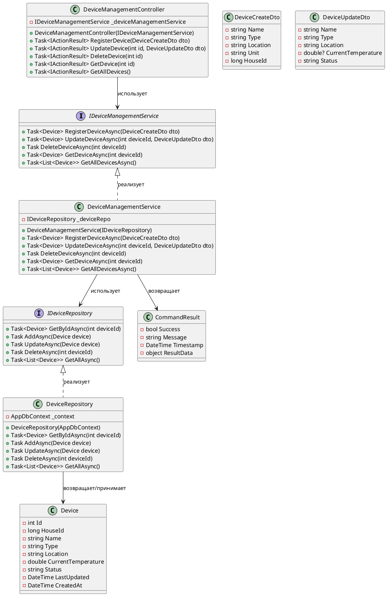

```puml
@startuml title Device Management Service - Class Diagram

interface IDeviceManagementService {
  + Task<Device> RegisterDeviceAsync(DeviceCreateDto dto)
  + Task<Device> UpdateDeviceAsync(int deviceId, DeviceUpdateDto dto)
  + Task DeleteDeviceAsync(int deviceId)
  + Task<Device> GetDeviceAsync(int deviceId)
  + Task<List<Device>> GetAllDevicesAsync()
}

interface IDeviceRepository {
  + Task<Device> GetByIdAsync(int deviceId)
  + Task AddAsync(Device device)
  + Task UpdateAsync(Device device)
  + Task DeleteAsync(int deviceId)
  + Task<List<Device>> GetAllAsync()
}

class DeviceManagementService {
  - IDeviceRepository _deviceRepo
  + DeviceManagementService(IDeviceRepository)
  + Task<Device> RegisterDeviceAsync(DeviceCreateDto dto)
  + Task<Device> UpdateDeviceAsync(int deviceId, DeviceUpdateDto dto)
  + Task DeleteDeviceAsync(int deviceId)
  + Task<Device> GetDeviceAsync(int deviceId)
  + Task<List<Device>> GetAllDevicesAsync()
}

class DeviceRepository {
  - AppDbContext _context
  + DeviceRepository(AppDbContext)
  + Task<Device> GetByIdAsync(int deviceId)
  + Task AddAsync(Device device)
  + Task UpdateAsync(Device device)
  + Task DeleteAsync(int deviceId)
  + Task<List<Device>> GetAllAsync()
}

class DeviceManagementController {
  - IDeviceManagementService _deviceManagementService
  + DeviceManagementController(IDeviceManagementService)
  + Task<IActionResult> RegisterDevice(DeviceCreateDto dto)
  + Task<IActionResult> UpdateDevice(int id, DeviceUpdateDto dto)
  + Task<IActionResult> DeleteDevice(int id)
  + Task<IActionResult> GetDevice(int id)
  + Task<IActionResult> GetAllDevices()
}

class Device {
  - int Id
  - long HouseId
  - string Name
  - string Type
  - string Location
  - double CurrentTemperature
  - string Status
  - DateTime LastUpdated
  - DateTime CreatedAt
}

class DeviceCreateDto {
  - string Name
  - string Type
  - string Location
  - string Unit
  - long HouseId
}

class DeviceUpdateDto {
  - string Name
  - string Type
  - string Location
  - double? CurrentTemperature
  - string Status
}

class CommandResult {
  - bool Success
  - string Message
  - DateTime Timestamp
  - object ResultData
}

DeviceManagementController --> IDeviceManagementService : использует

IDeviceManagementService <|.. DeviceManagementService : реализует

DeviceManagementService --> IDeviceRepository : использует

IDeviceRepository <|.. DeviceRepository : реализует

DeviceRepository --> Device : возвращает/принимает

DeviceManagementService --> CommandResult : возвращает

@enduml
```