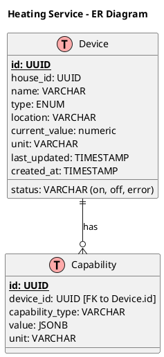

```puml
@startuml
!define table(x) class x << (T,#FFAAAA) >>
!define primary_key(x) <b><u>x</u></b>
!define foreign_key(x) <i>x</i>

title Heating Service - ER Diagram

table(Device) {
  <b><u>id: UUID</u></b>
  house_id: UUID
  name: VARCHAR
  type: ENUM
  location: VARCHAR
  status: VARCHAR (on, off, error)
  current_value: numeric
  unit: VARCHAR
  last_updated: TIMESTAMP
  created_at: TIMESTAMP
}

table(Capability) {
  <b><u>id: UUID</u></b>
  device_id: UUID [FK to Device.id]
  capability_type: VARCHAR
  value: JSONB
  unit: VARCHAR
}

Device ||--o{ Capability : has
@enduml
```