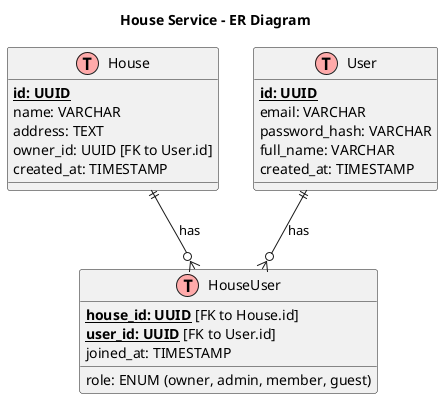

```puml
@startuml
!define table(x) class x << (T,#FFAAAA) >>
!define primary_key(x) <b><u>x</u></b>
!define foreign_key(x) <i>x</i>

title House Service - ER Diagram

table(House) {
  <b><u>id: UUID</u></b>
  name: VARCHAR
  address: TEXT
  owner_id: UUID [FK to User.id]
  created_at: TIMESTAMP
}

table(User) {
  <b><u>id: UUID</u></b>
  email: VARCHAR
  password_hash: VARCHAR
  full_name: VARCHAR
  created_at: TIMESTAMP
}

table(HouseUser) {
  <b><u>house_id: UUID</u></b> [FK to House.id]
  <b><u>user_id: UUID</u></b> [FK to User.id]
  role: ENUM (owner, admin, member, guest)
  joined_at: TIMESTAMP
}

House ||--o{ HouseUser : has
User ||--o{ HouseUser : has
@enduml
```