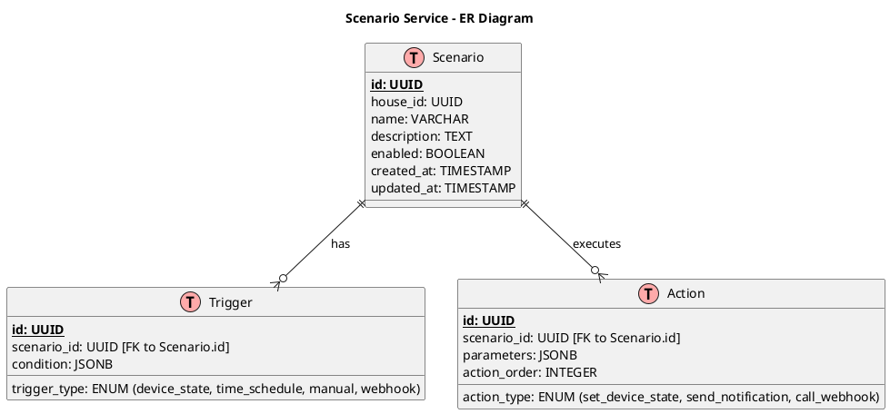

```puml
@startuml
!define table(x) class x << (T,#FFAAAA) >>
!define primary_key(x) <b><u>x</u></b>
!define foreign_key(x) <i>x</i>

title Scenario Service - ER Diagram

table(Scenario) {
  <b><u>id: UUID</u></b>
  house_id: UUID
  name: VARCHAR
  description: TEXT
  enabled: BOOLEAN
  created_at: TIMESTAMP
  updated_at: TIMESTAMP
}

table(Trigger) {
  <b><u>id: UUID</u></b>
  scenario_id: UUID [FK to Scenario.id]
  trigger_type: ENUM (device_state, time_schedule, manual, webhook)
  condition: JSONB
}

table(Action) {
  <b><u>id: UUID</u></b>
  scenario_id: UUID [FK to Scenario.id]
  action_type: ENUM (set_device_state, send_notification, call_webhook)
  parameters: JSONB
  action_order: INTEGER
}

Scenario ||--o{ Trigger : has
Scenario ||--o{ Action : executes
@enduml
```